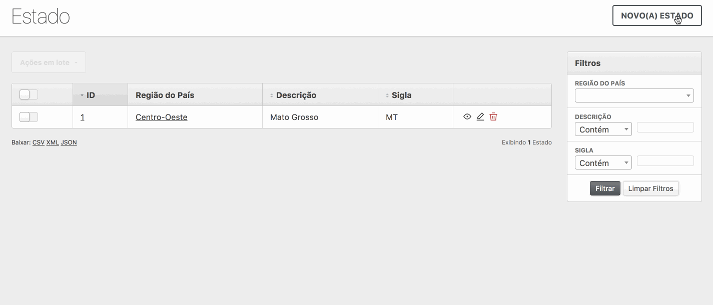

# ActiveAdmin Advanced Create Another
Create another resource with strength by default in your ActiveAdmin forms.



## Installation
Include to your Gemfile
```ruby
gem 'active_admin-advanced_create_another'
```

## Options
**Disable it in a specific resource**
```ruby
ActiveAdmin.register User do
  config.create_another = false
end
```

**Disable by default at all resources (change `config/initializers/active_admin.rb`)**
```ruby
ActiveAdmin.setup do
  config.create_another = false
end
```

## Maintainer
[Dhyego Fernando](https://github.com/dhyegofernando)
